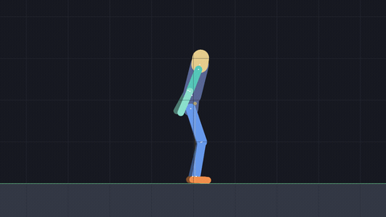
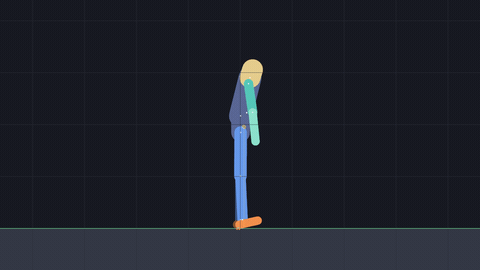
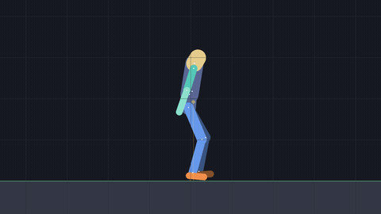
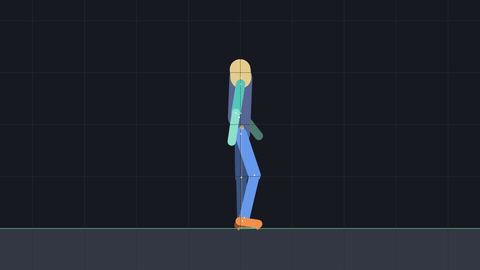
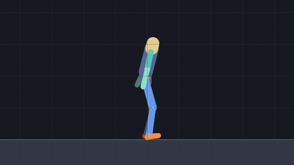
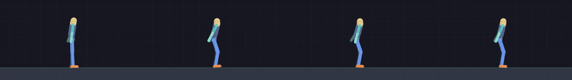

# aibackflip

**A humanoid that learns to backflip, on a physics engine written from scratch.**

No physics library. No animation playback, no inverse kinematics, no scripted trajectory. A
neural network reads joint angles and foot contacts at 60 Hz and outputs twelve motor targets,
and a hand-written rigid-body solver does the rest.



| | | | |
|---|---|---|---|
|  |  |  |  |
| forward roll, -360 deg | vertical jump | recovering from a 135 N.s shove | hit with 300 N.s at the apex |

```
12,317 lines of C++      rigid-body physics, constraint solver, humanoid, OpenGL renderer
 4,375 lines of Python   PPO, GAE, policy, normalisation, evaluation harnesses
   313 tests             216 C++, 97 Python, all green
     2 dependencies      GLFW for the window, PyTorch for autograd. Nothing else is vendored.
```

---

## How it learns



Four checkpoints from **one** training run, attempting the **same** reference
motion, side by side. Left to right: 120 updates, 720, 960, and 2,880.

The stages were chosen by measurement rather than by even spacing, so the panel
shows the arc instead of three copies of a solved policy. Every snapshot in the
run, measured with `flight_test.py` over 12 episodes each:

| updates | flips completed | rotation | peak height | airborne |
|---|---|---|---|---|
| 120 | 0% | 89 deg | 1.12x | 0.31 s |
| 480 | 0% | 191 deg | 1.23x | 0.37 s |
| 840 | 8% | 260 deg | 1.20x | 0.49 s |
| 960 | 33% | 226 deg | 1.34x | 0.44 s |
| 1,080 | 94% | 342 deg | 1.64x | 0.70 s |
| **1,440** | **42%** | **290 deg** | **1.47x** | **0.52 s** |
| 1,920 | 94% | 353 deg | 1.57x | 0.70 s |
| 2,280 | 100% | 360 deg | 1.65x | 0.70 s |
| 2,880 | 100% | 358 deg | 1.61x | 0.74 s |

The curve is not monotonic. Update 1,080 already lands 94% of flips and update
1,440 falls back to 42% before recovering. That row is in bold rather than
omitted: picking only the improving snapshots would have made a cleaner story
and a false one.

What the numbers describe is a figure that first learns to leave the ground at
all, then to rotate without finishing, then to finish without landing, and only
then to land. Rotation and airborne time move together, because a flip is won or
lost at takeoff: the angular momentum is set the moment the feet leave the
ground and nothing afterwards can add to it.

Reproduce the whole thing, snapshots included:

```powershell
.\scripts\train.ps1 -Config configs\ppo_imitate_fast.json `
                    -EnvConfig configs\env2d_backflip.json -Name flipshow -Envs 64
.\scripts\showcase.ps1
```

---

## Results

Every number here is produced by a command in this repository, run against a checkpoint that is
committed alongside it. Nothing is claimed from watching the screen.

| behaviour | result | reproduce with |
|---|---|---|
| **Backflip** | +358 deg mean rotation, 24/24 episodes complete, 0.71 s airborne, peak height 1.66x rest | `flight_test.py` |
| **Backflip, shoved mid-flight** | lands 100% up to 100 N.s, 83% at 200 N.s, 38% at 300 N.s | `flight_test.py` |
| **Backflip, trained against shoves** | 44% at 400 N.s against 12% untrained, costing 6 points at zero disturbance (96 episodes) | `flight_test.py` |
| **Backflip, gentler pose falloff** | 0.340 rad mean joint error against 0.475, flip unchanged at 100% and +356 deg | `track_test.py` |
| **Forward roll** | -360 deg, 24/24 episodes complete | `flight_test.py` |
| **Jump** | peak height 1.27x rest, 0.44 s with both feet clear of the ground | `flight_test.py` |
| **Standing** | 39 to 40 of 40 episodes reach the 1000-step limit across three seeds, surviving returns within 0.4% | `test.py` |
| **Push recovery** | thirteen shoves per episode, 0.8 s apart: 100% survive at 100 N.s, 96% at 115, 46% at 130, 8% at 145 | `push_test.py --interval 45` |

The complete engineering log, including every experiment that failed and what each one turned
out to be, is in [`docs/PROGRESS.md`](docs/PROGRESS.md).

---

## What was built

### The physics engine

A 2D rigid-body simulator in C++ with a sequential-impulse constraint solver: warm starting,
speculative contacts, a Coulomb friction cone, a restitution threshold, and a dedicated position
solver rather than Baumgarte stabilisation. Capsule bodies, capsule-vs-halfspace and
capsule-vs-capsule narrow phase, collision groups, semi-implicit Euler integration.

Verified numerically, not by eye. Joint anchor drift on a five-link chain yanked for six seconds
is **1.8 mm** worst case. Energy is monotonically non-increasing at every horizon measured, out
to 60 seconds and −16% by then: the solver only ever loses energy, never gains it, which is the
property that separates a stable solver from one that quietly explodes. The sign is the claim
here and the magnitude is not; one second of backflip does not care about a sixty-second figure.

### The humanoid

Thirteen capsule links, twelve revolute joints, 69 kg, 1.64 m. Each joint stacks an angular
motor, two one-sided limit constraints and a 2-DOF point constraint, solved in that order so the
point constraint gets the final say on position.

The figure is authored as a **rest pose** (a world position and angle per link, a world pivot per
joint) and the local anchors and reference angles are derived from it, so "every joint reads zero
at rest" is true by construction rather than by careful data entry.

### The learning

PPO written from scratch: clipped surrogate objective, GAE, advantage normalisation, entropy
bonus, gradient clipping, Schulman's low-variance KL estimator driving a target-KL early stop,
and learning-rate annealing. Actor and critic have separate trunks; the policy is Gaussian with a
tanh mean and a state-independent, clamped log-std.

Imitation is DeepMimic-style: exponential tracking rewards on pose, joint velocity, end-effector
position, root and centre of mass, with Reference State Initialization and early termination.

### The bridge

One UDP datagram carries all 64 environments per control step, with explicit little-endian
serialisation on both sides and no struct-padding assumptions anywhere. A HELLO/SPEC handshake
makes C++ tell Python the observation, action and reward dimensions, so Python never hardcodes a
shape. Requests are idempotent: a duplicate ACTION packet resends the cached STATE rather than
simulating the step twice.

```
    C++                                 UDP            Python
  +------------------------+                    +----------------------+
  | 64 environments        |   one batched      | PPO                  |
  |   rigid bodies         |   datagram per     |   actor-critic MLP   |
  |   contacts + friction  |   control step     |   GAE, clipped       |
  |   revolute joints      | <----------------> |   surrogate, KL stop |
  |   PD motors            |                    |   running obs norm   |
  |   111-value observation|                    |                      |
  |   18 raw reward terms  |                    |   reward *weights*   |
  +------------------------+                    +----------------------+
```

Design rationale is in [`docs/ARCHITECTURE.md`](docs/ARCHITECTURE.md), the wire format in
[`docs/PROTOCOL.md`](docs/PROTOCOL.md), the observation layout in
[`docs/OBSERVATIONS.md`](docs/OBSERVATIONS.md).

---

## Three design decisions that shaped everything else

**The simulator computes reward *terms*; Python owns the *weights*.** C++ is the only side that
can see contacts and the centre of mass, so it produces 18 raw non-negative quantities. Python
multiplies them by weights from a JSON file. Reward tuning then needs no rebuild, and because
every component is logged separately, reward hacking shows up as one term climbing while the
others stall. That is exactly how the squat policy was caught scoring 0.855 on pose matching
while lying flat on its back.

**Joint motors are implicit PD, solved as constraints.** An explicit torque `kp*e - kd*v` applied
per step is only stable while `kp*h^2 < inertia`, which caps the gains far below what a backflip
needs. Folding the spring into the solver as a soft constraint (`gamma = 1/(h*(kd + h*kp))`)
removes that ceiling. The measurable consequence: tracking bandwidth is `kp/kd`, and a knee
follows a commanded 3 Hz swing at 47% amplitude with the standing gains against 97% with the
acrobatic ones. The backflip is not trainable until that number is fixed.

**Reference State Initialization is not a refinement.** Episodes start at a random phase of the
reference clip, with the velocities belonging to that phase. Without it a policy has to master
the takeoff before it ever observes the landing, and for a backflip the takeoff is only worth
anything if the landing already works.

---

## Five things that were harder than expected

**A reward term that flags a problem changes nothing. Only a termination does.** This happened
three separate times. The squat policy lay on its back performing squat-shaped leg motions,
because joint angles are root-relative and a figure on the ground can hold the reference pose
perfectly. The jump policy rose onto its toes and never left the ground, hidden by episode
averaging on a reward the reference only demanded for 20 of 75 steps. In both cases raising the
weight was the tempting fix and adding a termination was the one that worked. Fixing the jump
moved peak height from 1.069 to 1.368 with a single threshold change and nothing else.

**Two reward terms were dead and nothing said so.** `joint_velocity_match` read exactly 0.000 for
a policy that was visibly performing the motion. An exponential tracking reward `exp(-k*e^2)` has
no gradient where it is saturated, so a term tuned to the wrong scale contributes nothing at all
while still appearing in the config, the logs and the total. Fixed by measuring what a working
policy actually achieves and putting the falloff in the middle of that range.

**A disturbance sweep returned an identical result at every magnitude.** 23/24 at 0 N.s and 23/24
at 180 N.s reads as extraordinary robustness. The generated config had been written standalone
instead of merged onto the motion config, so the simulator was running a different task, with no
motion clip and the wrong motor gains, and the "survival rate" was counting episodes that reached
a time limit doing nothing in particular. `flight_test.py` now carries a witness column measuring
the actual jump in angular velocity across the shove, and refuses to print a robustness result
when that column is flat.

**Robustness is bought, not found.** Fine-tuning the backflip against random off-centre shoves
more than triples completion at 400 N.s, from 12% to 44% over 96 episodes. It also makes the
policy a worse backflip: 94% at zero disturbance against 100%, and 349 degrees of rotation
against 357. Training against a gentler range gives up nearly all of the robustness while still
paying most of the cost, so there is no setting in between that avoids the trade. Both
checkpoints are kept, and the undisturbed one is the flip in the GIF at the top, because it is
the better flip.

**Two sides that agree can both be wrong.** The reference velocity of every looping clip flipped
sign at the loop point: the arm came down at 3.71 rad/s, touched the bottom, and left going up at
3.71 rad/s in the same instant. A looping clip repeats its first keyframe at the end, so index 0
and index n−1 are the same event written twice, and the tangent code read index 0's previous
neighbour as itself. No test could have caught it. The reward and the observation both read the
reference from that one sampler, so they agreed with each other perfectly at the broken value and
the physics was correct about a clip that was wrong. It took `track_test.py` recomputing the
reward term from an independently dumped table to disagree — on 2 steps out of 2880. The same
check immediately caught a second one: phase travels as sin and cos of phase × 2π, so phase 1.0
and phase 0.0 are the same two floats, and the end of every episode was being read as the start
of the clip.

---

## Verification

The rule this project runs on: **a number belongs in this README only if a command in this README
regenerates it.** Applying that rule cost two claims their original wording. Standing's "40/40
episodes" turned out to be one seed of three, the other two giving 39/40. The backflip's airborne
time and peak height were a maximum over episodes reported as though it were a mean. Both are
corrected above and the correction is recorded in `docs/PROGRESS.md`.

Re-running every claim in this table in M11 cost a third. Push recovery read "absorbs thirteen
115 N.s shoves per episode, falls at 145", and the `push_test.py` command printed next to it
produces six shoves rather than thirteen — the thirteen needs `--interval 45`, which was not
written down anywhere. Run properly, 115 N.s is 96% and not "absorbs", 145 N.s is 8% and not
"falls", and 130 N.s is 46%, a coin flip the sentence skipped over entirely by implying a clean
threshold between the two numbers it did quote. Every rounding went the flattering way. The row
now states the curve and the command that draws it.

The same pass confirmed the rest against fresh runs: 1.77 mm anchor drift, 47% against 97% knee
bandwidth, 69 kg and 1.64 m, standing at 39/40/39 over three seeds, the roll's −360° at 24/24,
and the backflip's whole disturbance sweep at 100/100/83/38/12%.

Physics correctness is asserted numerically: impulse responses against closed-form results, joint
anchor drift under load, energy behaviour, and finite-difference checks against the analytic
formulas the solver uses. Every acrobatic result is confirmed twice, once by measurement and once
by rendering the frames and looking at them.

```powershell
.\scripts\build.ps1                 # Release into build\bin\Release
.\scripts\test.ps1                  # 216 C++ cases and 97 Python cases
```

---

## Running it

Requires Visual Studio 2022 BuildTools (MSVC 14.4x), CMake 3.20+, and PyTorch. GLFW is fetched at
configure time; nothing else is vendored.

Watch a trained policy, or re-render the GIFs above:

```powershell
.\scripts\evaluate.ps1 -Model checkpoints\imit_backflip_best.pt `
                       -EnvConfig configs\env2d_backflip_capture.json
.\scripts\showcase.ps1 -Only results
```

Reproduce the headline measurements:

```powershell
python python\flight_test.py --model checkpoints\imit_backflip_best.pt `
                             --magnitudes 0 100 200 300 400 --offset 0.4
python python\push_test.py   --model checkpoints\robust_v1_best.pt `
                             --interval 45 --magnitudes 100 115 130 145 160
python python\track_test.py  --model checkpoints\k025_gentle_best.pt `
                             --config configs\env2d_backflip_capture.json
```

Train the backflip from scratch. 12M environment steps at 11.4k to 12.5k env-steps/s with 64
environments, so about 17 minutes end to end, measured over the two full runs in M11. The bare
simulator benchmarks at 38k to 46k (`aibf_diag throughput`) and that number is not this one: it
excludes the bridge, the observation, the reward terms, resets and the policy. Roughly three
quarters of a training step is the parts the benchmark leaves out.

```powershell
.\scripts\train.ps1 -Config configs\ppo_imitate_fast.json `
                    -EnvConfig configs\env2d_backflip.json -Name backflip -Envs 64
```

`venv\` is created with `--system-site-packages` so it inherits the installed CUDA build of torch
instead of re-downloading several GB:

```powershell
python -m venv --system-site-packages venv
.\venv\Scripts\python.exe -m pip install -r python\requirements.txt
```

---

## Layout

```
cpp/core        math, JSON with comments, PNG writer, PCG32, test runner
cpp/physics     rigid bodies, capsule collision, revolute joints, sequential-impulse solver
cpp/humanoid    13-link figure, forward kinematics, observations, reward terms
cpp/env         episodic environment, batching, auto-reset with final-observation capture
cpp/motion      keyframe clips, Hermite interpolation, phase sampling
cpp/engine      OpenGL 3.3 renderer with a hand-written 29-entry loader
cpp/tools       env server, diagnostics, protocol fixture, motion generator
python/rl       policy, PPO, GAE, running normalisation
python/         train.py, test.py, push_test.py (standing), flight_test.py (airborne),
                track_test.py (per-joint imitation error), reference.py (clip reader)
configs/        physics, body, task and hyperparameter configs
motions/        five hand-authored reference clips
scripts/        build, test, train, evaluate, demo
```

---

## What is not done

- **This is sagittal-plane 2D.** A cartwheel is a frontal-plane motion and cannot be represented
  in this figure at all, so it is not a hard case here, it is an impossible one. A 3D engine was
  built and trained to stand, then removed: the acrobatics did not land in the time available and
  a half-finished second engine was worth less than a finished first one. That work and why it
  was cut is in `docs/PROGRESS.md`, and it is in the git history.
- **Tracking is loose on the acrobatic motions,** though M11 found most of a fix. It is not the
  motors: every joint reaches two to ten times the peak rate its reference ever asks for, so the
  figure is not lagging a clip it cannot follow. It is the falloff, and specifically mid-clip —
  each motion tracks well at both ends and collapses in the middle, where `pose_match` reads
  1e-4 to 3e-3 and a saturated exponential has about 2000× less gradient than a healthy one.
  Retraining with the falloff at 0.25 instead of 2.0 cuts mean joint error from 0.475 rad to
  0.340 (27° to 19°) at no measurable cost to the flip: 100% completion, +356° against +358°.
  Still 19° per joint, so the policies continue to improvise the limbs; the jump and roll have
  not been retrained. `python python\track_test.py --model <ckpt>` reproduces the table.
- **The backflip is fragile at takeoff.** Shoved at 200 N.s during launch it completes 0% of
  flips, against 83% for the same shove at mid-flight. The robustness result is about the air,
  not the whole motion.
- Every "N/N" figure comes from a deterministic policy. Stochastic sampling was swept only for
  the backflip, at 22/24.
